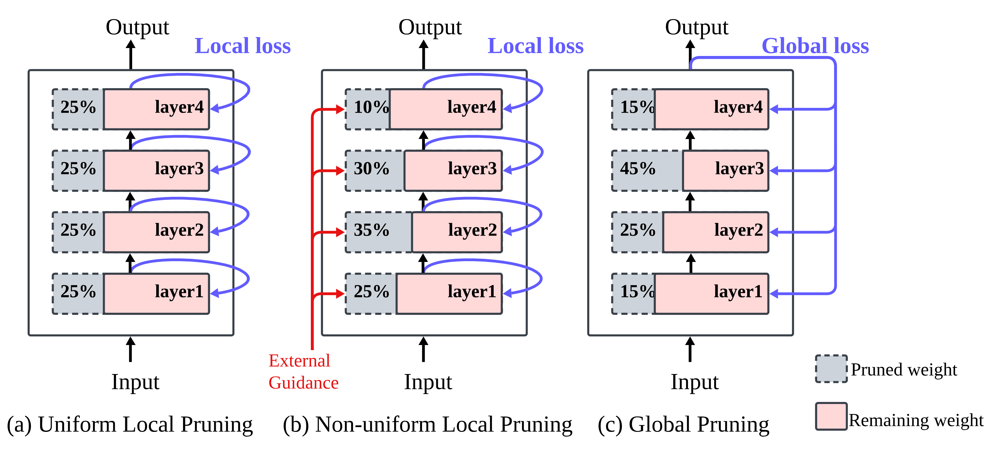
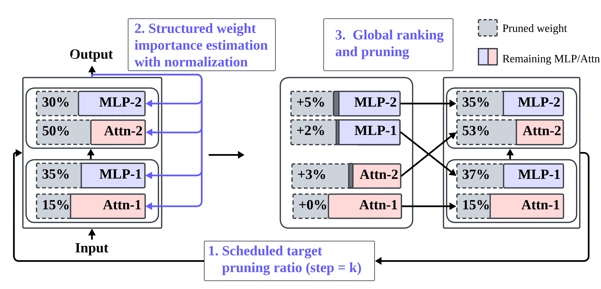

# GISP: Global Iterative Structured Pruning

**[From Local to Global: Revisiting Structured Pruning Paradigms for Large Language Models](https://aclanthology.org/2026.acl-long.1653/)**

Ziyan Wang<sup>1</sup>, Enmao Diao<sup>2</sup>, Qi Le<sup>3</sup>, Pu Wang<sup>1</sup>, Minwoo Lee<sup>1</sup>, Shu-ping Yeh<sup>4</sup>, Evgeny V Stupachenko<sup>4</sup>, Hao Feng<sup>4</sup>, and Li Yang<sup>1</sup>

<sup>1</sup> University of North Carolina at Charlotte · <sup>2</sup> DreamSoul<br>
<sup>3</sup> University of Minnesota · <sup>4</sup> Intel Corporation

**ACL 2026 · Main Conference · Oral**

**[Outstanding Paper Award](https://2026.aclweb.org/program/best_papers/) · SAC Highlight**

[Paper](https://arxiv.org/abs/2510.18030) · [ACL Anthology](https://aclanthology.org/2026.acl-long.1653/) · [Code](https://github.com/uncc-efficient-ai/GISP)

We introduce **GISP**, a method for compressing large language models by iteratively removing attention heads and MLP channels. GISP scores structures using gradients of the model's loss, allowing pruning decisions to reflect the task we want to preserve.

[](assets/pruning-paradigms.pdf)

*Pruning paradigms ([Figure 1](https://arxiv.org/html/2510.18030v2#S1.F1)). Local methods use layer reconstruction losses; global pruning measures importance against the model's final loss.*

[](assets/gisp-overview.pdf)

*Overview of GISP ([Figure 2](https://arxiv.org/html/2510.18030v2#S3.F2)). Each iteration updates structural importance and applies global pruning at the scheduled ratio.*

- **Global importance:** aggregate first-order weight importance into structural scores, normalize across attention and MLP blocks, and rank structures across the model.
- **Iterative pruning:** recompute importance as pruning progresses, without fine-tuning between steps.
- **Task-specific objectives:** use language-modeling loss for text or a margin objective over correct and incorrect answers for multiple-choice tasks.
- **Multiple compression levels:** retain nested subnetworks along a single pruning trajectory.

## Results

Results at **40% pruning**, from [Tables 4 and 5](https://arxiv.org/html/2510.18030v2#S3.T4). PPL uses C4 calibration; CMQA accuracy uses task-specific calibration. These are separate pruning runs, without post-pruning fine-tuning.

| Model | Wanda-sp PPL ↓ | GISP PPL ↓ | Wanda-sp CMQA accuracy (%) ↑ | GISP CMQA accuracy (%) ↑ |
| --- | ---: | ---: | ---: | ---: |
| Llama-2-7B | 51.85 | **34.54** | 50.12 | **55.28** |
| Llama-2-13B | 32.91 | **26.56** | 59.11 | **63.34** |
| Llama-3-8B | 81.67 | **46.10** | 43.61 | **53.51** |
| Mistral-7B-v0.3 | 55.41 | **34.31** | 51.89 | **58.30** |

PPL is measured on WikiText-2. CMQA accuracy is averaged over BoolQ, PIQA, HellaSwag, WinoGrande, ARC-Easy, ARC-Challenge, and OpenBookQA.

## Installation

Use Python 3.10 and an NVIDIA GPU with a compatible CUDA driver. The dependencies pin PyTorch 2.4.0, Transformers 4.40.2, and PEFT 0.5.0.

```bash
git clone https://github.com/uncc-efficient-ai/GISP.git
cd GISP

python3.10 -m venv .venv
source .venv/bin/activate
python -m pip install --upgrade pip
python -m pip install -r requirements.txt
python -m pip install -e modules/eval/lm-evaluation-harness
```

For gated models, request access on Hugging Face and authenticate before running:

```bash
huggingface-cli login
```

## Quick start

Run the following commands from the cloned repository directory. The data loaders download C4 and the CMQA datasets through Hugging Face Datasets.

### Language-modeling calibration

Prune Llama-2-7B using C4:

```bash
CUDA_VISIBLE_DEVICES=0 python main.py \
  --config_path external_code/GISP/script/GISP/c4/GISPv2_0_llama2_7b_c4.yml
```

This configuration samples 2,000 sequences of 256 tokens for calibration.

### Commonsense-QA calibration

Prune Llama-2-7B using the margin objective on CMQA:

```bash
CUDA_VISIBLE_DEVICES=0 python main.py \
  --config_path external_code/GISP/script/GISP/cmqa/GISPv2_0_llama2_7b_cmqa_ori.yml
```

The `cmqa_no_pad` loader divides a 512,000-token calibration budget across the seven tasks and constructs positive and negative answer candidates from their training splits.

Both examples evaluate intermediate models near 20%, 30%, 40%, and 50% parameter sparsity. Pruning needs memory for the model and gradients; reduce `task.prune.batch_size` to lower the calibration batch memory requirement. Intermediate evaluation also keeps a model backup in CPU memory.

### Other models

Use the corresponding configuration under `external_code/GISP/script/GISP/c4/` or `external_code/GISP/script/GISP/cmqa/`:

| Model | Hugging Face model ID | C4 configuration | CMQA configuration |
| --- | --- | --- | --- |
| Llama-2-7B | `meta-llama/Llama-2-7b-hf` | `GISPv2_0_llama2_7b_c4.yml` | `GISPv2_0_llama2_7b_cmqa_ori.yml` |
| Llama-2-13B | `meta-llama/Llama-2-13b-hf` | `GISPv2_0_llama2_13b_c4.yml` | `GISPv2_0_llama2_13b_cmqa_ori.yml` |
| Llama-3-8B | `meta-llama/Meta-Llama-3-8B` | `GISPv2_0_llama3_8b_c4.yml` | `GISPv2_0_llama3_8b_cmqa_ori.yml` |
| Mistral-7B-v0.3 | `mistralai/Mistral-7B-v0.3` | `GISPv2_0_mistral_7b_c4.yml` | `GISPv2_0_mistral_7b_cmqa_ori.yml` |

## Configuration

Experiments are configured through YAML files passed to `main.py` with `--config_path`. Copy a configuration to customize a run. The main options are:

| Option | Description |
| --- | --- |
| `model.name` | Pretrained model identifier |
| `model.torch_dtype` | Model precision; the supplied configurations use `bfloat16` |
| `task.seed` | Random seed for the run and calibration sampling |
| `task.prune.prune_dataset` | Calibration dataset and sample or token budget |
| `task.prune.batch_size` | Calibration batch size |
| `task.prune.ratio` | Final fraction of ranked structures selected by the pruning schedule |
| `task.prune.iteration` | Number of pruning steps: 112 for the supplied 7B/8B configurations and 280 for 13B |
| `task.prune.eval_intermediate` | Parameter sparsities at which to evaluate intermediate models |
| `evaluation.lm_eval_options.tasks` | Downstream evaluation tasks |
| `task.output_folder` | Directory for configuration, logs, pruning records, and evaluation results |

The structural pruning ratio and the fraction of model parameters removed differ because heads and MLP channels have different sizes. Use the measured sparsity recorded in the output to select a model at a desired compression level.

### Data and output paths

The configuration loader resolves the following environment variables:

| Variable | Default | Purpose |
| --- | --- | --- |
| `GISP_ROOT` | Directory containing `main.py` | Source and custom model/pruner packages |
| `GISP_DATA_ROOT` | `${GISP_ROOT}/data` | Local datasets |
| `GISP_OUTPUT_ROOT` | `${GISP_ROOT}/outputs` | Experiment outputs |
| `GISP_CACHE_ROOT` | `${GISP_DATA_ROOT}/cache` | Generated calibration caches |

For example:

```bash
export GISP_ROOT="$PWD"
export GISP_DATA_ROOT="$GISP_ROOT/data"
export GISP_OUTPUT_ROOT="$GISP_ROOT/outputs"
export GISP_CACHE_ROOT="$GISP_DATA_ROOT/cache"
```

Source, data, and output paths in the supplied pruning configurations are resolved against these roots. Hugging Face downloads use its cache settings, such as `HF_HOME`.

### Evaluation outputs

Each run saves its resolved `config.yml` and log file under `task.output_folder`. The GISP trajectory also produces:

- `sp_<sparsity>.pth`: pruning records with structural masks and importance statistics.
- `sp_<sparsity>_ppl.pth`: perplexity results for evaluated intermediate models.
- `0_sp_<sparsity>_lm_eval.json`: zero-shot task results for intermediate models.
- `0_lm_eval_result.json`: final zero-shot task results.

The trajectory files store pruning state for restoring subnetworks from the original pretrained model. The checkpoint evaluator under `external_code/GISP/experiments/calibration_trajectory/` applies the saved masks and evaluates the resulting models.

## Additional experiments

All configurations below use the same `python main.py --config_path <config.yml>` entry point. Paths are relative to `external_code/GISP/script/`.

| Experiment | Configuration directory |
| --- | --- |
| Wanda-sp | `Wanda-sp/` |
| FLAP | `FLAP/` |
| OWL | `OWL/` |
| ShortGPT | `shortGPT/` |
| LoRA after pruning | `Prune_ft/` |
| Calibration budget and sampling seeds | `GISP/cmqa/calibration_ablations/` |
| Calibration trajectory evaluation | `GISP/cmqa/trajectory/different_size/` |
| MedQA | `GISP/medqa/`, `Wanda-sp/medqa/`, and `Dense/medqa/` |

For LoRA experiments, first generate a pruning checkpoint and set `task.prune.restore_config.checkpoint_path` in the selected `Prune_ft` configuration to that file. The adaptation code is under `external_code/GISP/experiments/table8_lora/`. To run without online Weights & Biases logging, set `WANDB_MODE=offline`.

For trajectory evaluation, set `task.prune.restore_config.checkpoint_path` to a directory containing the selected `sp_<sparsity>.pth` pruning records. Keep evaluation-result files in a separate directory from these selected records.

## Code structure

```text
main.py                              Experiment entry point
external_code/GISP/
  modeling/                          Llama and Mistral model implementations
  pruners/                           GISP and comparison methods
  experiments/
    table8_lora/                     LoRA adaptation after pruning
    calibration_trajectory/          Subnetwork restoration and evaluation
  script/                            Experiment configurations
modules/
  config/                            YAML configuration and path resolution
  data/                              Calibration and training data loaders
  model/                             Model and tokenizer loading
  eval/                              Perplexity and downstream evaluation
  reports/                           Experiment reporting
  system/                            Device and distributed execution
tasks/                              Pruning, evaluation, and training workflows
```

The core GISP implementation is `external_code/GISP/pruners/grad_sp_global.py`. Shared pruning operations and mask handling are implemented in `non_uniform_pruner.py` and `utils.py` in the same directory.

## License

GISP is released under the [Apache License 2.0](LICENSE). Third-party components retain their original licenses; see [Third-party notices](THIRD_PARTY_NOTICES.md).

Figures 1 and 2 are from our paper and licensed under [CC BY 4.0](https://creativecommons.org/licenses/by/4.0/), with attribution in [assets/NOTICE](assets/NOTICE). Pretrained models and datasets remain subject to their respective licenses.

## Citation

If you use GISP in your research, please cite our paper:

```bibtex
@inproceedings{wang-etal-2026-local,
  title = {From Local to Global: Revisiting Structured Pruning Paradigms for Large Language Models},
  author = {Wang, Ziyan and Diao, Enmao and Le, Qi and Wang, Pu and Lee, Minwoo and Yeh, Shu-ping and Stupachenko, Evgeny and Feng, Hao and Yang, Li},
  booktitle = {Proceedings of the 64th Annual Meeting of the Association for Computational Linguistics (Volume 1: Long Papers)},
  year = {2026},
  month = jul,
  publisher = {Association for Computational Linguistics},
  pages = {35720--35739},
  doi = {10.18653/v1/2026.acl-long.1653},
  url = {https://aclanthology.org/2026.acl-long.1653/}
}
```
